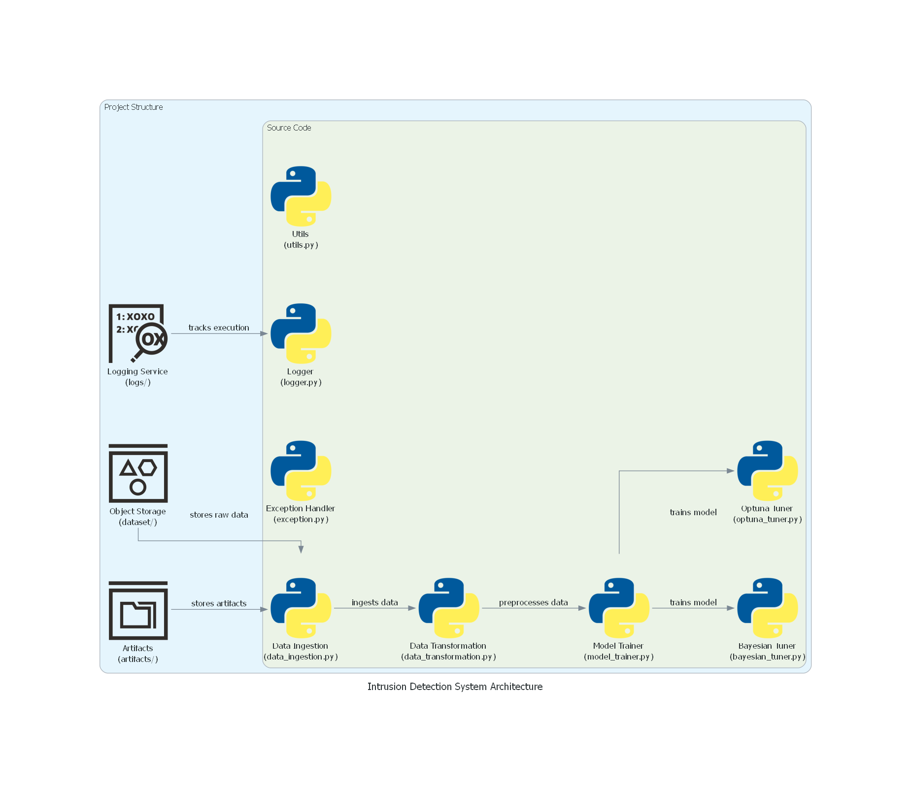

# Intrusion Detection System (IDS)
  
  
  
 

---

## 🚀 UPDATE! [July 2025]

📹 **Demo Video:**
[](https://youtu.be/PJu7FfHhPmQ)


🌐 **Live App:**
[Try the deployed IDS app here](https://ids-api-frontend.onrender.com)

> We’ve launched the first version of the web-based IDS system using the XGBoost model from Part 1!  
> This includes fast inference on network flow data, batch upload support, and a clean UI for predictions and visualizations.

> Stay tuned!

---

## Table of Contents
1. [Overview](#overview)
2. [Project Structure](#project-structure)
3. [Features](#key-features)
4. [Performace](#performance-metrics)
5. [Installation](#installation)
6. [Usage](#usage)
7. [Hyperparameter Tuning](#hyperparameter-tuning)
8. [Model Evaluation](#model-evaluation)
9. [Docker Setup](#docker-setup)
10. [Future Work](#future-work)
11. [Contributing](#contributing)


## Overview

This project involves developing an Intrusion Detection System (IDS) using machine learning techniques to identify and prevent network intrusions. The final model is an XGBoost classifier trained on the CICIDS2018 dataset. The project incorporates full data pipeline automation — from ingestion to deployment — and is production-ready with Docker support.


## Project Structure
``` bash
├── .gitattributes
├── .gitignore
├── Dockerfile                 # Docker configuration for containerization
├── README.md
├── requirements.txt           # Project dependencies
├── setup.py                   # Package setup script

├── artifacts/                 # Folder for artifacts like trained models and preprocessed data
│   ├── IDS_data.csv           # Original dataset
│   ├── model_trained.keras      # Trained model
│   ├── model_trained.pkl      # Trained model
│   ├── preprocessor.pkl       # Data preprocessor
│   ├── test.csv               # Test dataset
│   └── train.csv              # Training dataset

├── dataset/                   # Folder containing dataset files
│   └── train_data.csv         # Raw training data

├── logs/                      # Log files for tracking execution

├── src/                       # Source code for the project
│   ├── exception.py           # Custom exception handling
│   ├── logger.py              # Logging module
│   ├── utils.py               # Utility functions

│   ├── components/            # Folder containing main components
│   │   ├── data_ingestion.py  # Data ingestion logic
│   │   ├── data_transformation.py  # Data preprocessing and feature engineering
│   │   ├── model_trainer.py # Model training and evaluation
│   │   ├── bayesian_tuner.py  # Bayesian hyperparameter tuning
│   │   ├── optuna_tuner.py    # Optuna hyperparameter tuning
│   │   └── __init__.py
│   └── __init__.py
```


## Key Features

- **Data Preprocessing**: 
  - Data ingestion and transformation processes to clean and prepare the CICIDS2018 dataset.
  - Handling missing values, encoding categorical features, and scaling numerical data.
  
- **Model Training**:
  - Includes neural networks (commented), with final model selected as XGBoost based on performance.
  - Training and evaluation of the model with performance metrics.

- **Hyperparameter Tuning**:
  - Utilization of Optuna for optimizing hyperparameters to enhance model performance.

- **Model Evaluation**:
  - Metrics used include accuracy, precision, recall, F1 score, and ROC AUC.

- **Docker Containerization**:
  - The project includes a Dockerfile to simplify the deployment of the IDS. This allows the application to run consistently across various environments.

## Performance Metrics

Final model: XGBoost Classifier
- Testing Accuracy Score: 89.75%
- Training Accuracy Score: 89.87%
- Testing F1 Score: 88.27%
- Training F1 Score: 88.40%
- Testing Recall Score: 89.75%
- Training Recall Score: 89.87%
- Testing Precision Score: 89.08%
- Training Precision Score: 89.31%
- Balanced Accuracy Score: 86.55%
- ROC AUC (Testing): 99.17%
- ROC AUC (Training): 99.21%

These results indicate a well-performing model that generalizes effectively to unseen data, achieving high accuracy and a strong balance between precision and recall.


## Installation

1. Clone the repository:
   ```bash
   git clone https://github.com/username/IDS.git
   ```

2. Navigate to the project directory:
   ```bash
   cd IDS
   ```

3. Create and activate a virtual environment (optional but recommended):
   ```bash
   python -m venv venv
   source venv/bin/activate   # For Windows: venv\Scripts\activate
   ```

4. Install required dependencies:
   ```bash
   pip install -r requirements.txt
   ```

## Usage

1. Run the data ingestion pipeline:
   ```bash
   python src/components/data_ingestion.py
   ```

2. (Optional) Perform hyperparameter tuning:
   ```bash
   python src/components/bayesian_tuner.py
   python src/components/optuna_tuner.py
   ```

3. View logs for detailed execution info:
   ```bash
   tail -f logs/*.log
   ```

## Hyperparameter Tuning

This project includes two methods for tuning model hyperparameters:

1. **Bayesian Optimization:** This uses probabilistic models to explore the hyperparameter space. Run it using:
   ```bash
   python src/components/bayesian_tuner.py
   ```

2. **Optuna:** A popular framework for efficient hyperparameter optimization. To use Optuna, run:
   ```bash
   python src/components/optuna_tuner.py
   ```

Both methods aim to improve the model’s accuracy while reducing training time.

## Model Evaluation

After training the model, it's evaluated using the following metrics:

- **Accuracy:** Measures the percentage of correct predictions.
- **Precision & Recall:** Useful for understanding the trade-off between false positives and false negatives.
- **F1-score:** A balanced measure between precision and recall.

## Docker Setup

The Dockerfile provided sets up the environment with TensorFlow and Python 3 support, installs the necessary dependencies, and exposes the required port for monitoring.

#### Option 1: Build the Docker Image Locally

1. **Build the Docker image**:

   ```bash
   docker build -t ids-system .
   ```
2. **Run the Docker container**:

```bash
docker run -p 6006:6006 ids-system
```
This exposes port 6006 for TensorBoard or other monitoring tools.

3. **Default Command: The default command in the container is to run the data ingestion script**:

```bash
CMD ["python", "src/components/data_ingestion.py"]
```
You can modify the command to run other scripts as needed.

4. **Access Monitoring Tools**: Access TensorBoard or any other monitoring tools at http://localhost:6006.

### Option 2: Pull the Docker Image from Docker Hub
If you prefer not to build the image locally, you can directly pull the pre-built Docker image from Docker Hub:

1. **Pull the Docker image**:

```bash
docker pull saimquadri/ids-project
```

2. **Run the Docker container**:

```bash
docker run -p 6006:6006 saimquadri/ids-project
```
This will expose port 6006 for monitoring tools like TensorBoard.

## Future Work

- Add support for additional machine learning algorithms.
- Implement real-time intrusion detection using streaming data.
- Improve model accuracy with advanced feature engineering techniques.
- Expand Docker support to Kubernetes for large-scale deployments.
- Feature selection and ensemble model stacking.
- Integration with cloud-based dashboards for alerts

## Contributing

We welcome contributions from the community! Please feel free to fork the repository and submit a pull request with your improvements. For major changes, please open an issue first to discuss what you would like to change.
To contribute:

1. Fork the repository.
2. Create a new branch for your feature:
   ```bash
   git checkout -b feature/your-feature
   ```

3. Make your changes and push to your branch:
   ```bash
   git push origin feature/your-feature
   ```

4. Create a pull request

## License
This project is licensed under the MIT License(Modified for Attribution and Non-Commercial Use). See the [LICENSE](./LICENSE) file for details.

